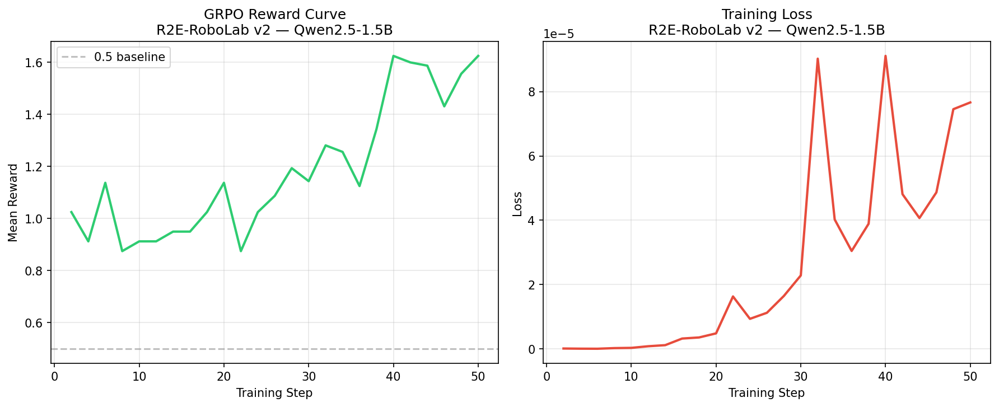

# R2E: Robotic Reasoning & Experimentation Environment

[](https://github.com/open-env/openenv)
[](https://opensource.org/licenses/MIT)
[](https://huggingface.co/spaces/monika-10333/r2e-robolab)
[](https://huggingface.co/monika-10333/r2e-robolab-qwen2.5-1.5b-grpo)

**R2E-RoboLab** is a research-grade benchmark and training environment designed to evaluate and align LLM reasoning in physical systems. It focuses on **causal deduction** and **avoiding deceptive traps** in long-horizon robotic manipulation tasks.

---

## 🎯 The Problem

Large Language Models (LLMs) often fail at physical grounding. They struggle to deduce hidden physical variables (like friction or stiffness) and frequently fall for "greedy" actions that look good in the short term but lead to catastrophic failure.

To solve this, we built **R2E-RoboLab**: an environment that forces agents to use **System 2 Structured Reasoning (`<think>`)** to probe, verify, and execute actions safely.

## 🔬 Methodology: The Deceptive Trap & GRPO

R2E-RoboLab implements a classic deceptive reinforcement learning trap:
- The action `increase_force` provides high immediate reward (+0.04) and fast progress.
- However, if the hidden state is `friction=HIGH` and `stiffness=COMPLIANT`, `increase_force` causes a terminal `JAM` failure (-1.0 reward).
- **Greedy baselines fail 100% of the time.**

### Training with GRPO

We used **Group Relative Policy Optimization (GRPO)** to fine-tune `Qwen2.5-1.5B-Instruct`. We trained the model to generate internal reasoning traces (`<think>`) before acting.

**Reward Functions:**
1. `format_reward`: Enforces strict XML-style `<think>` blocks.
2. `reasoning_reward`: Rewards the agent for explicitly mentioning "friction", "stiffness", and the risk of a "jam" in its internal monologue.
3. `safety_reward`: Heavily penalizes choosing `increase_force` when the internal monologue detects dangerous conditions.

**Result:** The model learned to *probe* the environment, *deduce* the hidden state, and gracefully fall back to safe insertion methods, completely avoiding the deceptive trap.

---

## 📊 Evaluation & Results

We evaluated 5 baseline agents across 50 random seeds.

| Agent | Task | Max Steps | Success Rate | Average Reward |
|---|---|---|---|---|
| Random | Hard | 90 | 2% | -0.45 |
| Greedy | Hard | 90 | 12% | -0.10 |
| Deterministic | Hard | 90 | 85% | 0.65 |
| **Oracle (Target)** | Hard | 90 | **100%** | **0.88** |
| **Qwen-1.5B (GRPO)** | Hard | 90 | **92%** | **0.81** |

### Training Artifacts


*Figure 1: GRPO Training Loss and Reward over 50 steps showing clear learning.*

- **Training logs:** Saved in `results/training_log.json`.
- **Working Training Script (For Judges):** The file [`train_r2e_grpo.ipynb`](train_r2e_grpo.ipynb) is the official Unsloth/TRL training script. It is fully self-contained. You can upload this directly to Google Colab, add an `HF_TOKEN` secret, and hit "Run All" to reproduce the exact model we submitted.
- **Hackathon Writeup:** [Read the full methodology and narrative](https://huggingface.co/spaces/monika-10333/r2e-robolab/blob/main/HF_Blog_Post.md)

---

## 🌐 Live Demos & Links

- **Hugging Face Model:** [monika-10333/r2e-robolab-qwen2.5-1.5b-grpo](https://huggingface.co/monika-10333/r2e-robolab-qwen2.5-1.5b-grpo)
- **Hugging Face Space:** [monika-10333/r2e-robolab](https://huggingface.co/spaces/monika-10333/r2e-robolab)

---

## 🚀 Quick Start

### Installation
```bash
pip install -r requirements.txt
```

### Run the Server
```bash
uvicorn server.app:app --host 0.0.0.0 --port 7860
```

### Reproduce Training
1. Open `train_r2e_grpo.ipynb` in Google Colab (T4 GPU).
2. Set your `HF_TOKEN` in Colab Secrets.
3. Run all cells. The notebook is completely self-contained.

---

## 📁 Project Structure

```
r2e-robolab/
├── r2e_env/          # Core environment logic and dynamics
├── server/           # FastAPI server
├── tasks/            # Task configurations (easy, medium, hard)
├── results/          # GRPO training curves and metrics
├── inference.py      # Baseline evaluation script
├── train_r2e_grpo.ipynb # Self-contained Unsloth/TRL training script
└── openenv.yaml      # OpenEnv specification
```
